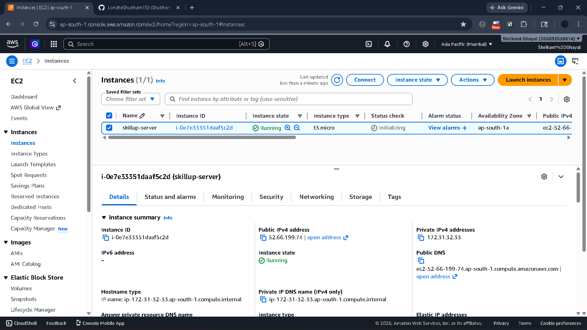
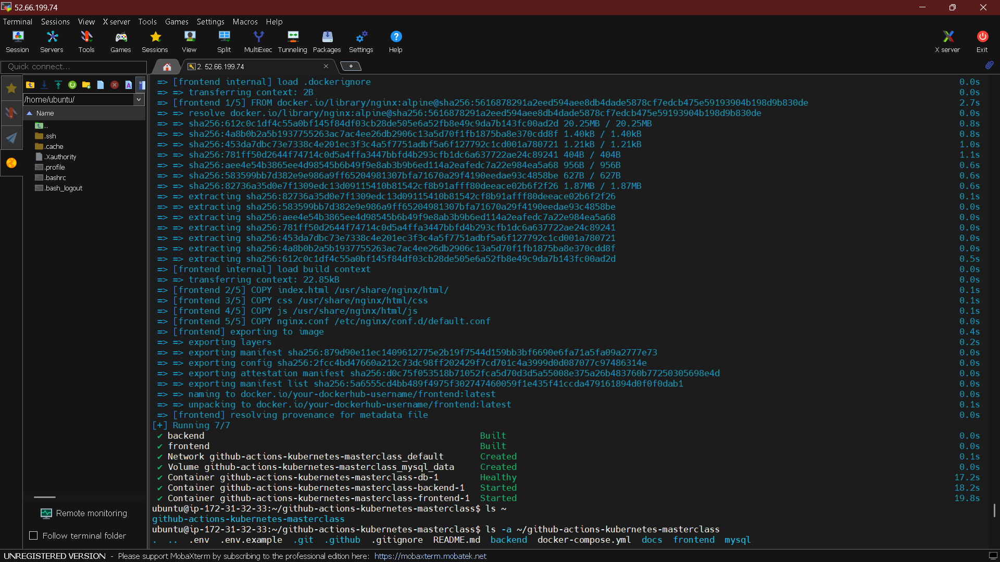
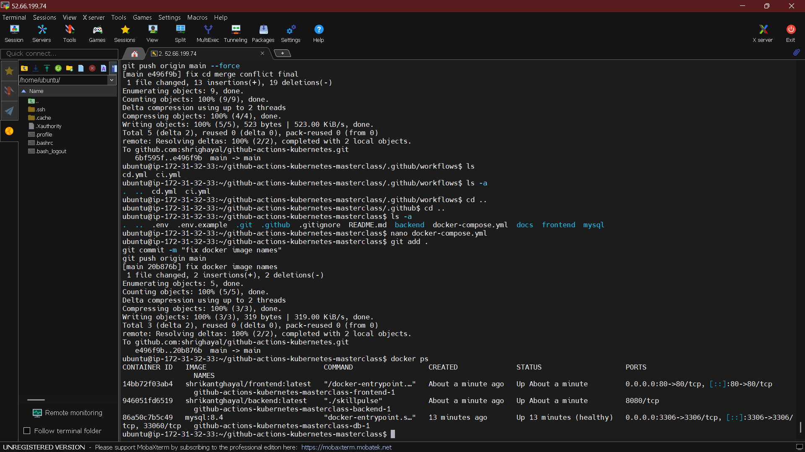
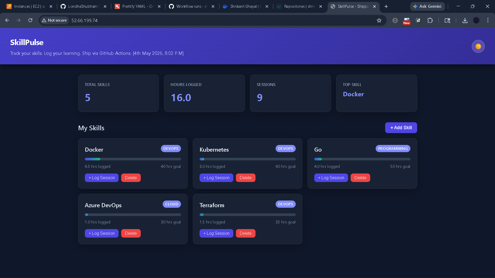

# 🚀 SkillPulse - DevOps CI/CD Project

A full-stack **DevOps project** demonstrating end-to-end CI/CD pipeline using:

- GitHub Actions (CI/CD)
- Docker & Docker Compose
- AWS EC2 Deployment
- MySQL Database
- Nginx Frontend

---

## 🌐 Live Demo

👉 http://52.66.199.74

---

## 📌 Project Overview

SkillPulse is a skill tracking application where users can:

- Track learning progress
- Log skill sessions
- Monitor hours and goals
- Visualize growth

---

## 🏗️ Architecture


---

## What this project demonstrates

A real pipeline, end to end, in roughly 50 lines of YAML.

```
┌─────────────┐     git push        ┌──────────────────┐
│  Developer  ├────────────────────▶│  GitHub Repo     │
└─────────────┘                     └────────┬─────────┘
                                             │ on: push (main)
                                             ▼
                                    ┌──────────────────┐
                                    │  CI Workflow     │
                                    │  - build images  │
                                    │  - tag :sha      │
                                    │  - tag :latest   │
                                    │  - push to Hub   │
                                    └────────┬─────────┘
                                             │ workflow_run: success
                                             ▼
                                    ┌──────────────────┐
                                    │  CD Workflow     │
                                    │  - SSH to EC2    │
                                    │  - git pull      │
                                    │  - compose pull  │
                                    │  - compose up -d │
                                    └────────┬─────────┘
                                             │
                                             ▼
                                    ┌──────────────────┐
                                    │  EC2: live app   │
                                    │  http://<host>   │
                                    └──────────────────┘
```

### CI — `.github/workflows/ci.yml`

Triggered on every push to `main`. It does four things:

1. **Checks out the code.** A fresh clone in a clean Ubuntu runner — no laptop state to leak.
2. **Builds two Docker images.** A Go backend and an Nginx-served frontend. Both are multi-stage so the final images are small.
3. **Tags each image twice.** With the commit SHA (`:abc1234…`) and with `:latest`. The SHA tag is your rollback handle — you can always pin a deploy to an exact commit. The `:latest` tag is what production pulls.
4. **Pushes both to Docker Hub.** Authenticated with secrets (`DOCKERHUB_USERNAME`, `DOCKERHUB_TOKEN`) — never plaintext credentials in the repo.

The non-obvious lesson: **CI doesn't just test your code. It produces an artifact.** That artifact — the image — is what production runs. If the artifact is built consistently in CI, it's the same in dev, staging, and prod. "Works on my machine" stops being a possibility.

### CD — `.github/workflows/cd.yml`

Triggered automatically when CI completes successfully (`workflow_run` + a `conclusion == 'success'` gate). Skipped if CI failed — you cannot deploy a broken build.

It SSHes into an EC2 instance and runs:

```bash
if [ ! -d ~/skillpulse ]; then
  git clone <this repo> ~/skillpulse
fi
cd ~/skillpulse
git pull origin main
[ -f .env ] || { echo "ERROR: .env missing"; exit 1; }
docker compose pull
docker compose up -d
docker image prune -f
```

Every line earns its place:

- The `if [ ! -d ... ]` makes the script **idempotent** — the same script runs whether it's the first deploy or the hundredth.
- The `.env` check fails *loudly* with a useful message instead of letting `docker compose` produce a cryptic error about missing variables.
- `docker compose pull` brings in the image you just built. `up -d` only recreates containers whose image actually changed — backend and DB don't get bounced if you only edited frontend HTML.
- `docker image prune -f` keeps the EC2 disk from filling up with old image layers over weeks of deploys.

### Secrets used

| Secret | What it is |
|---|---|
| `DOCKERHUB_USERNAME` | Your Docker Hub account name |
| `DOCKERHUB_TOKEN` | A Docker Hub Personal Access Token with read+write scope |
| `EC2_HOST` | Public IP or DNS of the deploy target |
| `EC2_USER` | Linux user on the EC2 (typically `ubuntu`) |
| `EC2_SSH_KEY` | Private key contents — paste the entire `.pem` file as the secret value |

Set them at `Settings → Secrets and variables → Actions` on your fork.

---

## The application itself

A three-tier app — kept tiny on purpose so the pipeline is the star.

| Tier | Tech | What it does |
|---|---|---|
| Frontend | HTML + CSS + vanilla JS, served by Nginx | UI for adding skills and logging hours |
| Backend | Go 1.26 + Gin | REST API at `/api/...` |
| Database | MySQL 8.4 | Stores skills and learning logs |

Nginx in the frontend image also reverse-proxies `/api/` and `/health` to the backend, so the public surface is a single port (`80`).

API surface:

```
GET    /api/skills              list skills + total hours
POST   /api/skills              create skill
GET    /api/skills/:id          one skill + its logs
DELETE /api/skills/:id          delete skill (cascades logs)
POST   /api/skills/:id/log      log a study session
GET    /api/dashboard           summary counters
GET    /health                  DB ping for healthchecks
```

---

## Run it locally

```bash
cp .env.example .env             # fill in DOCKERHUB_USERNAME (anything works for local)
docker compose up -d --build
```

Open http://localhost. Backend port 8080 is intentionally not exposed — all traffic goes through Nginx, exactly like production.

To tear down:

```bash
docker compose down -v           # -v also drops the MySQL volume
```

---

## Deploy your own copy

1. **Fork this repo.**
2. **Provision an Ubuntu EC2** (any size; `t3.micro` is enough to learn). Open ports `22` (your IP) and `80` (the world). Note the public IP and the `.pem` key.
3. **Install Docker on the EC2:**
   ```bash
   curl -fsSL https://get.docker.com | sh
   sudo usermod -aG docker $USER && newgrp docker
   ```
4. **Create `~/skillpulse/.env` on the EC2** with the same variables as `.env.example` plus your Docker Hub username.
5. **Add the five secrets** to your fork's repo settings (see table above).
6. **Push any commit to `main`.** Watch the Actions tab. ~90 seconds later, your EC2 IP serves the app.

Break it on purpose to learn:

- Push a commit that fails to build → CD is *skipped*, not run-and-failed.
- Rotate the Docker Hub token → next CI fails at the login step. Now you know what an expired credential looks like in logs.
- Delete `~/skillpulse/.env` on the EC2 → next CD exits with the explicit error message instead of a cryptic compose failure.

---

## Project layout

```
backend/                Go service
  Dockerfile            multi-stage: golang:1.26-alpine → alpine:3.23
  main.go               wires routes, reads PORT env
  database/db.go        connects to MySQL with retry-loop
  handlers/             skills, logs, dashboard endpoints
  models/               request/response structs

frontend/               static UI + Nginx config
  Dockerfile            FROM nginx:alpine, copies html/css/js + nginx.conf
  index.html, css/, js/ vanilla — no build step
  nginx.conf            serves the site, proxies /api/ to backend:8080

mysql/init.sql          schema + seed data, mounted into the MySQL container

docker-compose.yml      three services: db, backend, frontend
.env.example            copy to .env

.github/workflows/
  ci.yml                build + push images on every main push
  cd.yml                SSH + redeploy on CI success
```

---

## Where this goes next

This is the **GitHub Actions** half of the masterclass. The pipeline currently deploys to a single EC2 via SSH + docker compose — a fine starting point, and the most common "first real pipeline" in the industry.

The Kubernetes half of the course evolves this same app onto a cluster:

- Replace `docker compose` with manifests (Deployment, Service, Ingress).
- Replace SSH-driven deploys with `kubectl apply` from CI, then with GitOps (Argo CD / Flux).
- Add health checks, autoscaling, rolling updates with no downtime, secrets via Kubernetes Secrets or external managers.
- Run the cluster on EKS / GKE / AKS or local (kind / minikube).

Same app. Same pipeline shape. Different runtime — and a lot more power.

---

---

## ☁️ AWS Deployment

- EC2 Instance (Ubuntu)

- Docker + Docker Compose installed
- Security Group:
  - Port 80 (HTTP)
  - Port 22 (SSH)
  - Port 3306 (optional)

---

## 🔑 GitHub Secrets

| Secret Name        | Description |
|------------------|------------|
| DOCKERHUB_USERNAME | DockerHub username |
| DOCKERHUB_TOKEN    | DockerHub access token |
| EC2_HOST           | EC2 public IP |
| EC2_USER           | ubuntu |
| EC2_SSH_KEY        | Private SSH key |

---

## 📸 Screenshots

### Application UI


---

## 💡 Key Learnings

- CI/CD pipeline automation
- Docker multi-service architecture
- GitHub Actions workflow debugging
- AWS EC2 deployment
- Real-world DevOps troubleshooting

---



## 📈 Future Improvements

- Kubernetes (EKS)
- HTTPS with Nginx + SSL
- Domain integration
- Monitoring (Prometheus + Grafana)
- Auto-scaling

---


## 👨‍💻 Author


[THANK YOU TRAINWITHSHUBHAM]

**Shrikant Ghayal**

- GitHub: https://github.com/shrighayal

---

## ⭐ If you like this project

Give it a ⭐ on GitHub!
